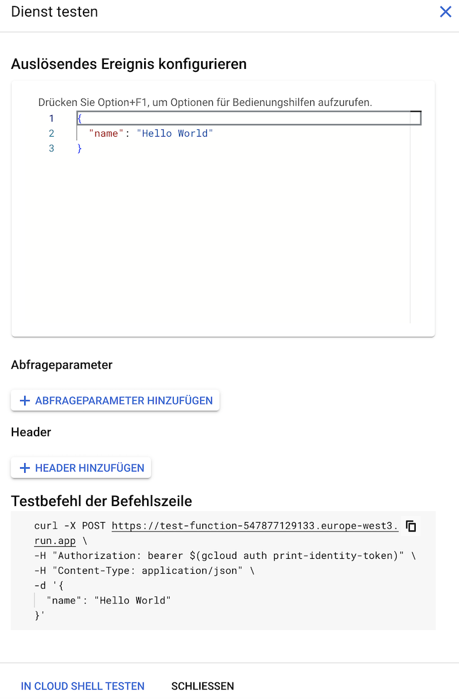

# Übung 7 - Serverless Computing

**Aufgabe 1 - Eine Google Cloud Run Function schreiben und testen**

Hinweis: Diese Übung ist freiwillig! Sie erfordert zumindest das Anlegen eines kostenlosen Testaccounts unter [https://cloud.google.com/](https://cloud.google.com/). Selbst der kostenlose Test-Account erfordert jedoch die Angabe von z. B. Kreditkarteninformationen. Es liegt in ihrem eigenen Ermessen, ob Sie entsprechende Angaben machen möchten. Wichtig ist in jedem Fall, die angelegten Ressourcen wieder zu löschen (wie, das wird in dieser Anleitung erklärt). Die Verwendung der entsprechenden Dienste erfolgt jedoch unter eigener Verantwortung!  

Anmerkung: Wir nutzen hier ein IaaS-Angebot der Google Cloud exemplarisch. Dies lässt sich bei anderen Cloud-Providern wie AWS, Azure, IBM etc. in ähnlicher Weise nutzen. 

Für diese Aufgabe müssen Sie zunächst ein Projekt in der Google Cloud Console anlegen (siehe hierzu Anleitung zu Übung 3, Aufgabe 1).  

In den Einstellungen müssen Sie folgende Berechtigungen aktivieren: Cloud Functions, Cloud Build, Artifact Registry, Cloud Run, Logging und Pub/Sub APIs.  

Wählen Sie in der Cloud Console die Übersichtsseite zu Google Cloud Functions aus.  

Klicken Sie auf "Funktion mit einem Inline-Editor" erstellen. Vergeben Sie einen Namen für die Funktion, wählen Sie eine Region aus und wählen Sie unter Laufzeit "Node.js 20".

Sobald Sie alles eingerichtet haben, können Sie in den Quellcode-Editor wechseln. Fügen Sie dort den Code aus der Datei `function.js` ein (falls hier noch nichts hinterlegt ist).

Öffnen Sie anschließend den Tab "Test". 

Klicken Sie auf "In Cloud Shell ausführen". Dann sollte sich unterhalb ein Terminal-Fenster öffnen, in dem der Code zur Testausführung hinterlegt ist und den Sie per Eingabetaste ausführen können (ggf. müssen Sie die Cloud Shell noch autorisieren).  

Anschließend können Sie unter "Messwerte" einsehen, welche Ressourcen für die Funktionsausführung benutzt wurden.

**Wichtig:**

Löschen Sie die Ressourcen anschließend wieder (siehe Anleitung zu Übung 3, Aufgabe 1)!

